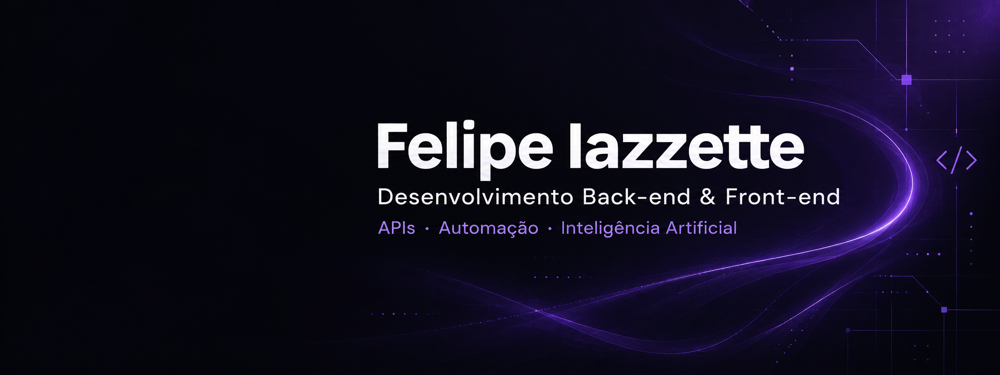
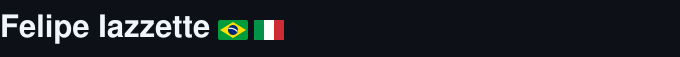
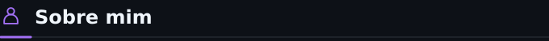
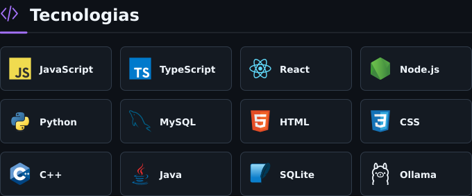
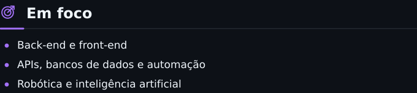
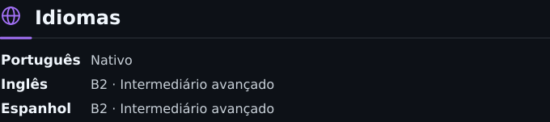

  

  <picture>
    <source media="(max-width: 600px)" srcset="./perfil-nome-mobile-v2.svg">
    
  </picture>

  <picture>
    <source media="(max-width: 600px)" srcset="./perfil-sobre-mobile.svg">
    
  </picture>

Técnico em **Informática pelo Senac**.  
Estudante de **Engenharia de Software — 2º semestre**.  
Desenvolvimento web, APIs, automação, robótica e IA aplicada.

  <picture>
    <source media="(max-width: 600px)" srcset="./perfil-tecnologias-mobile.svg">
    
  </picture>

  <picture>
    <source media="(max-width: 600px)" srcset="./perfil-foco-mobile.svg">
    
  </picture>

  <picture>
    <source media="(max-width: 600px)" srcset="./perfil-idiomas-mobile.svg">
    
  </picture>

---

  
  
  

